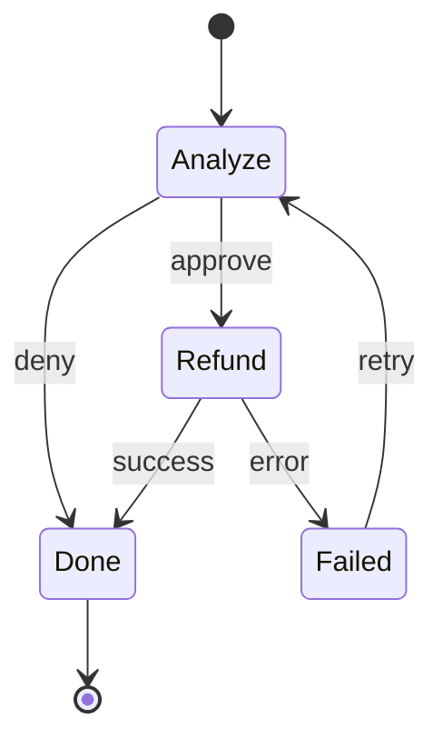
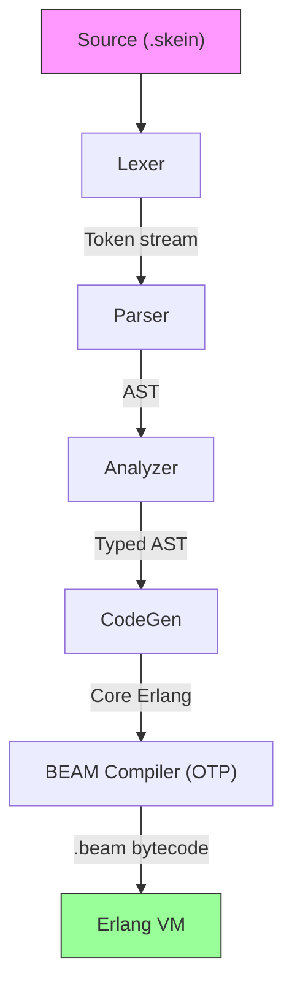

# Skein

[](https://github.com/kormie/Skein/releases)
[](https://github.com/kormie/Skein/actions/workflows/ci.yml)
[](https://github.com/kormie/Skein/actions/workflows/deploy-docs.yml)
[](https://github.com/kormie/Skein/releases)
[](LICENSE)

**A programming language where AI agents are first-class citizens.**

Skein compiles to BEAM bytecode and runs on the Erlang VM — the same battle-tested runtime behind WhatsApp, Discord, and millions of telecom systems. It's designed for building cloud services where reliability matters and AI agents do real work.

```rust
agent RefundAgent {
  capability model("anthropic", "claude-opus-4-8")
  capability store.table("tickets")

  state {
    ticket_id: String
  }

  enum Phase {
    Analyze -> [Refund, Done]
    Refund  -> [Done, Failed]
    Failed  -> [Analyze]
    Done    -> []
  }

  on start(ticket_id: String) -> {
    transition(Phase.Analyze)
  }

  on phase(Phase.Analyze) -> {
    let ticket = store.tickets.get!(state.ticket_id)
    let decision = llm.chat(
      "claude-opus-4-8",
      "Decide if this refund is warranted. Reply approve or deny.",
      ticket
    )
    match decision {
      "approve" -> transition(Phase.Refund)
      "deny"    -> transition(Phase.Done)
    }
  }

  on phase(Phase.Refund) -> {
    emit RefundIssued { ticket_id: state.ticket_id }
    transition(Phase.Done)
  }

  on phase(Phase.Failed) -> {
    suspend("Needs human review")
  }

  on phase(Phase.Done) -> {
    stop()
  }
}
```

> The compiler verifies every phase transition, every side effect, and every type contract — before a single line runs. This example compiles as-is with today's compiler.

The phase graph above compiles to a verified state machine — the compiler rejects invalid transitions before your code ever runs:



---

## Why Skein?

Most languages treat AI agents as library code running inside a general-purpose runtime. Skein treats them as the **primary abstraction**.

**Agents are state machines.** Phases, transitions, and terminal states are declared in the language and verified at compile time. Invalid transitions don't compile.

**Side effects require capabilities.** Every network call, database query, and LLM invocation must be declared upfront. This isn't just for safety — it gives you a complete manifest of what any piece of code can do.

**Types generate schemas.** Define a type once and Skein derives JSON encoders, LLM tool manifests, API contracts, and database migrations automatically. No serialization boilerplate.

**The entire spec fits in a context window.** The complete language specification is under 128K tokens. An LLM can hold all of Skein in memory and generate valid code reliably.

---

## Language at a Glance

### 12 constructs. One way to do things.

```rust
-- Bindings are immutable
let user = store.users.get!(id)

-- Pattern matching is the only conditional
match user.status {
  Active    -> process_order(user)
  Suspended -> respond.json(403, { "error": "account suspended" })
  Deleted   -> respond.json(404, { "error": "not found" })
}

-- Pipes compose operations
request.body
  |> validate[CreateOrderInput]
  |> enrich_with_inventory
  |> store.orders.put!
  |> respond.json(201)
```

### Types as contracts

```rust
type Money {
  amount: Int       @min(0)
  currency: String  @one_of(["USD", "CAD", "EUR"])
}

type Pagination {
  page: Int      @min(1)
  per_page: Int  @min(1) @max(100) @default(25)
}

enum OrderStatus {
  Pending
  Confirmed(confirmed_at: Instant)
  Shipped(tracking_id: String)
  Delivered(delivered_at: Instant)
  Cancelled(reason: String)
}
```

Annotations like `@min`, `@max`, and `@one_of` flow through to JSON Schema, validation, and LLM tool definitions — all generated from this single source of truth.

### Capabilities declare intent

```rust
module PaymentService {
  capability http.in
  capability http.out("api.stripe.com")
  capability store.table("transactions")
  capability model("anthropic", "claude-opus-4-8")

  -- The compiler enforces these boundaries.
  -- Code that tries to call an undeclared endpoint won't compile.
}
```

### Handlers respond to the world

```rust
handler http POST "/refunds" (req) -> {
  let input = req.json[RefundRequest]?
  RefundAgent.start(ticket_id: input.ticket_id, customer_id: input.customer_id)
  respond.json(202, { "status": "processing" })
}

handler queue "billing.events" (msg) -> {
  idempotent(msg.id)
  match msg.json[BillingEvent]? {
    BillingEvent.ChargeSucceeded(c) -> record_charge(c)
    BillingEvent.DisputeCreated(d)  -> handle_dispute(d)
  }
}

handler schedule "0 9 * * MON" (tick) -> {
  generate_weekly_report() |> send_to_slack("#ops")
}
```

### Tools separate contract from implementation

```rust
tool Stripe.CreateRefund {
  description: "Creates a refund via Stripe."

  input {
    customer_id: String  @description("Stripe customer ID")
    amount: Int          @description("Amount in cents") @min(1)
  }

  output {
    id: String
    amount: Int
    status: String
  }

  policy {
    require_approval: true
    rate_limit: 10 per minute
    audit_level: full
  }

  implement { ... }
}
```

LLM tool-calling manifests are auto-generated from the contract. The implementation can be swapped or mocked independently.

### Automatic observability

Every operation produces structured trace spans with zero instrumentation code:

```
Trace: handle_refund_request (abc-123)
├── http.handler POST /refunds (12ms)
│   ├── store.get User (2ms)
│   ├── agent.start RefundAgent (0ms)
│   │   ├── phase.Analyze (1,203ms)
│   │   │   ├── store.get Ticket (3ms)
│   │   │   └── llm.json claude-opus-4-8 (1,198ms) [$0.002]
│   │   ├── phase.Refund (456ms)
│   │   │   └── tool.call Stripe.CreateRefund (453ms)
│   │   └── phase.Done (0ms)
│   └── event.emit RefundIssued (1ms)
└── Result: Ok (1,674ms total)
```

Traces can be replayed for testing: fully recorded, live against real services, or a hybrid of both.

---

## Design Decisions

| Decision | What Skein does | Why |
|---|---|---|
| No `if/else` | `match` only | One control flow construct, zero ambiguity |
| No anonymous lambdas | Named functions + `&ref` | Named code is easier to trace and reason about |
| No exceptions | `Result[T, E]` + OTP crash semantics | Two clear paths, no hidden control flow |
| Braces always | Mandatory `{ }` | Unambiguous parsing for humans and machines |
| Structured errors | JSON with `fix_hint` and `fix_code` | Enables automated self-correction loops |
| Spec fits in 128K tokens | Entire language in one document | Any LLM can hold the full language in context |

What these promises mean across versions — which surfaces are stable, what
semver covers for a language + runtime + toolchain, and the deprecation
policy — is defined in [docs/STABILITY.md](docs/STABILITY.md).

---

## Getting Started

### Option A: Prebuilt binary (no dependencies)

One command — downloads the binary for your platform, verifies its SHA-256
against the release checksums, and installs to `~/.local/bin` (no root):

```bash
curl -fsSL https://kormie.github.io/Skein/install.sh | sh
```

Pin a version or change the install directory with environment variables:

```bash
curl -fsSL https://kormie.github.io/Skein/install.sh | SKEIN_VERSION=0.1.7 sh
curl -fsSL https://kormie.github.io/Skein/install.sh | SKEIN_BIN_DIR=/usr/local/bin sh
```

Prefer to inspect before running? The script is
[`install.sh`](install.sh) in the repo root. Or install manually: download
the asset for your platform from the
[Releases page](https://github.com/kormie/Skein/releases) — no Erlang or
Elixir install required.

| Platform | Asset |
|---|---|
| Linux x86_64 | `skein-linux-x86_64` |
| Linux ARM64 | `skein-linux-aarch64` |
| macOS x86_64 | `skein-macos-x86_64` |
| macOS ARM64 (Apple Silicon) | `skein-macos-aarch64` |

```bash
# Manual install: download, make executable, and put it on your PATH
chmod +x skein-*
mv skein-* /usr/local/bin/skein

skein version             # → skein 1.0.0-rc.4

# Compile a file
skein compile hello.skein

# Scaffold a new project
skein new my-agent

# See all commands
skein help
```

#### zsh tab-completion (optional)

```bash
mkdir -p ~/.zfunc
skein completions zsh > ~/.zfunc/_skein
# in ~/.zshrc, before compinit:
#   fpath=(~/.zfunc $fpath)
```

### Option B: Build from source

#### Prerequisites

- Erlang/OTP 28+
- Elixir 1.19+

#### Build and test

```bash
git clone https://github.com/kormie/Skein.git
cd Skein

# mise reads .mise.toml for the right Erlang/Elixir versions
mise install

mise exec -- mix deps.get
mise exec -- mix compile
mise exec -- mix test
```

### Run the LLM demo

```bash
ANTHROPIC_API_KEY=sk-ant-... mise exec -- mix run examples/demo.exs
```

```
✅ Anthropic backend configured

📝 Compiling Skein module with LLM capability...
✅ Compiled module: Skein.User.Demo

🤖 Calling llm.chat via Skein...

📞 mod.greet("World")
   → Hello there, World — welcome to the wonderful world of Skein!

📞 mod.classify("I love this new programming language!")
   → positive

📊 Trace spans:
   • llm:chat claude-opus-4-8 (1.2s) ✅
     tokens: 28 in → 15 out
   • llm:chat claude-opus-4-8 (0.4s) ✅
     tokens: 31 in → 3 out
```

Every LLM call is capability-gated, type-checked, and automatically traced with token usage.

---

## Project Status

> **Release posture (2026-06-19): Skein is pre-1.0.** The version string (`1.0.0-rc.4`) is a holdover from a prematurely-tagged RC; **v1.0.0 GA is not imminent and the next release is a development release (`0.4.0`), not another RC.** A source-verified audit found that analyzer/codegen soundness is not yet established and the runtime effect/schema/store/EventStore contracts are drifted from the spec; nothing is "frozen" yet. The path to a sound, honest, dogfood-proven 1.0 is the contract-first wave plan in [docs/ROADMAP.md](docs/ROADMAP.md).

The compilation pipeline was built in phases — the *pipeline* is complete end-to-end — but the soundness and runtime-contract hardening for a stable 1.0 is in progress. [docs/ROADMAP.md](docs/ROADMAP.md) tracks what's next:

| Phase | Goal | Status |
|-------|------|--------|
| **1** | **Hello BEAM** — end-to-end compilation pipeline | Complete |
| **2** | **Type system** — named types, enums, type checking, schema derivation | Complete |
| **3** | **Capabilities** — declared effects, compile-time + runtime checking | Complete |
| **4** | **HTTP handlers** — routing, request/response, Bandit + Plug server | Complete |
| **5** | **Storage** — typed records, ETS backend, capability enforcement | Complete |
| **6** | **Agents** — state machines, LLM calls, tools, memory | Complete |
| **7** | **Testing & CLI** — test constructs, replay, golden traces, CLI tooling | Complete |
| **8a** | **Test infrastructure** — scenario, golden, replay constructs | Complete |
| **8c** | **HTTP server** — Bandit + Plug, `req.json[T]` validation | Complete |
| **8d** | **Canonical examples** — 5 working `.skein` programs with integration tests | Complete |
| **8e** | **Queue & schedule handlers** — event-driven and cron-triggered execution | Complete |
| **8f** | **LLM streaming** — `llm.stream` with chunked responses and trace spans | Complete |
| **8b** | **Storage backend** — Ecto/SQLite integration, schema + migration generation | Complete |
| **9-10** | **Stdlib, error codes, unified event store** — 11 stdlib modules (101 functions), the structured error/warning registry (spec §7 alignment is being reconciled — E0028/E0029 are implemented but not yet listed in the table), single append-only event log (ETS; SQLite persistence is opt-in and currently not on the ordinary append path) | Pipeline complete; contracts hardening |

The full test suite (unit, property-based, and integration) runs green in CI on every change — see the CI badge above for current totals. The compilation pipeline works end-to-end — from `.skein` source to running BEAM bytecode with real LLM calls and database storage. See [`examples/`](examples/README.md) for sixteen working programs, all covered by integration tests, and [docs/ROADMAP.md](docs/ROADMAP.md) for what's next.

---

## Architecture



The compiler is written in Elixir. The runtime is a set of OTP behaviours — agents run as supervised `gen_statem` processes, HTTP goes through Bandit + Plug, storage through Ecto.

See [ARCHITECTURE.md](docs/ARCHITECTURE.md) for the full picture.

---

## Documentation

| Document | What it covers |
|----------|----------------|
| [Language Specification](docs/SKEIN_SPEC.md) | Every syntax rule, type rule, and standard library function |
| [Architecture](docs/ARCHITECTURE.md) | Compiler pipeline, runtime design, supervision tree |
| [Roadmap](docs/ROADMAP.md) | Prioritized work list and current limitations |
| [Examples](examples/README.md) | Sixteen working programs, from hello-world to a multi-file agent system |
| [Design Rationale](docs/skein_first_principles.md) | First principles and the "why" behind every decision |
| [Documentation Site](https://kormie.github.io/Skein/) | Published docs with LLM-friendly endpoints |

**For LLMs:** The documentation site publishes machine-readable formats at [`/llms.txt`](https://kormie.github.io/Skein/llms.txt) and [`/llms-full.txt`](https://kormie.github.io/Skein/llms-full.txt). Architecture diagrams are available as DOT (Graphviz) in [`docs/diagrams/`](docs/diagrams/).

---

## Contributing

The project uses an Elixir umbrella structure under `apps/`:

- **`skein_compiler`** — Lexer, parser, analyzer, code generator
- **`skein_runtime`** — OTP behaviours, LLM client, storage, tracing
- **`skein_cli`** — Command-line tooling

```bash
mix test          # Run all tests
mix format        # Format code
```

TDD is mandatory — write tests before or alongside implementation. See [CLAUDE.md](CLAUDE.md) for the full set of conventions.

## License

Skein is released under the [MIT License](LICENSE).
